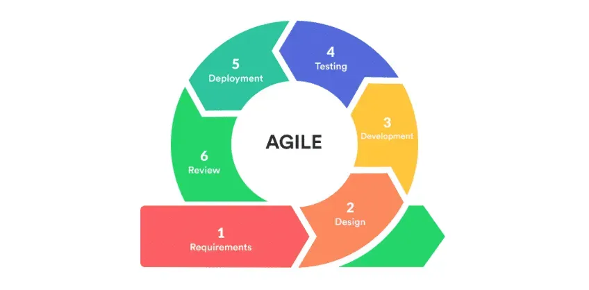
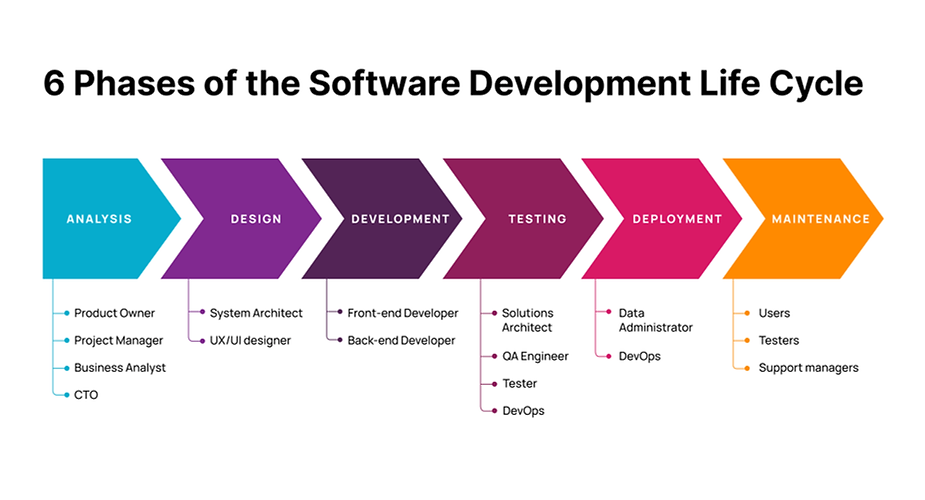

 # Course Documentation
 *This repository contains documentation for topics covered in the full-stack .Net development course. Below are detailed descriptions of four key documents included in this repository: Agile and Scrum, and Software Development Life Cycle (SDLC), Web development stacks and git version control.*
 
 ## Table of Contens

- [Agile and Scrum](#agile-and-scrum)
- [Software Development Life Cycle (SDLC)](#software-development-life-cycle-sdlc)
- [Web development stacks](#Web-development-stacks)
- [Git Version Control](#Git-Version-Control)
- [Algorithm Examples](#Algorithm-Examples)  

## Agile and Scrum

The "Agile and Scrum" document explains the Agile methodology and Scrum framework, which are widely used for managing and delivering projects in an iterative and collaborative manner. Key topics covered include:

- **Agile Principles**: The core values and principles that guide Agile development, emphasizing flexibility, customer collaboration, and continuous improvement.
- **Scrum Framework**: An overview of Scrum, including roles (Scrum Master, Product Owner, Development Team), artifacts (Product Backlog, Sprint Backlog, Increment), and events (Sprint Planning, Daily Scrum, Sprint Review, Sprint Retrospective).
- **Benefits of Agile and Scrum**: Advantages of using Agile and Scrum in software development, such as improved product quality, increased customer satisfaction, and better project visibility.





## Software Development Life Cycle (SDLC)

The "Software Development Life Cycle" document provides an in-depth look at the SDLC, a process used for planning, creating, testing, and deploying software applications. Key topics covered include:

- **Phases of SDLC**: Detailed descriptions of the various phases of the SDLC, including Analysis, Design, Implementation, Testing, Deployment, and Maintenance.
- **Models of SDLC**: Different models of the SDLC, such as Waterfall, V-Model, Incremental, and Agile, and their respective advantages and disadvantages.
- **Best Practices**: Recommended best practices for each phase of the SDLC to ensure the successful delivery of high-quality software projects.



## Web development stacks

### Overview  
In web applications, we have three main layers, each with its own services:  
- **Data Tier**: Database services  
- **Logic Tier**: Backend services  
- **Presentation Tier**: Frontend services

A **web development stack** is a set of tools and technologies used to build web applications.

### Popular Web Development Stacks  
- **.NET Stack**: Uses C#, SQL Server, and the .NET framework. Ideal for high-performance web applications.  
- **MERN Stack**: MongoDB, Express.js, React, and Node.js.  
- **MEAN Stack**: Similar to MERN but uses Angular instead of React.  
- **Serverless Stack**: Uses cloud infrastructure for scalability and cost-effectiveness.  
- **LAMP Stack**: Linux, Apache, MySQL, and PHP.  
- **PERN Stack**: Similar to MERN but with PostgreSQL instead of MongoDB.  
- **Ruby on Rails Stack**: Uses Ruby on Rails along with HTML, CSS, and JavaScript, known for security and simplicity.  

### .NET Full-Stack Development  

### **Frontend**  
- **Client-side rendering**: Blazor, Angular, Next.js  
- **Server-side rendering**: MVC, Blazor  
- **IDE**: Visual Studio Code  

### **Backend**  
- **Language**: C#  
- **Framework**: .NET Core  
- **IDE**: Visual Studio + SSMS  
- **API Development**: Connects frontend and backend  

### **Database**  
- **Database**: SQL Server  
- **ORM**: Entity Framework  

### **Testing**  
- **API Testing**: Postman  
- **Unit Testing**: xUnit  

### **Deployment**  
- **Technologies**: Docker, Azure  

### **Security**  
- **Standard**: OWASP  

### **Logging**  
- **Tool**: Serilog  

### **Payment Gateway**  
- **Service**: Stripe
  


## Git Version Control  

### Overview  
Git is a **distributed version control system (VCS)** used to track changes in source code during software development. It is widely used for **speed, efficiency, and collaboration**.  

### Why Use Git?  
- **Version Control**: Keep track of changes and revert to previous versions if needed.  
- **Cloud Backup**: Store code in a remote repository to prevent data loss.  
- **Collaboration**: Work with teams remotely on the same project.  

### Cloud Repositories  

There are many cloud repositories that use Git for version control. The most popular ones are:  

- **GitHub**: The most popular cloud-based Git repository, ideal for open-source projects and enterprise development.  
- **GitLab**: A complete DevOps platform offering Git repository hosting with built-in CI/CD.  
- **Azure Repos**: Microsoft’s Git-based repository solution integrated with Azure services and DevOps tools.  

### Git Commands  

Here is a set of essential Git commands along with their descriptions:  

| Command | Description |
|---------|------------|
| `git config --global user.name "Your Name"` | Sets the username for Git commits. |
| `git config --global user.email "your.email@example.com"` | Sets the email for Git commits. |
| `git init` | Initializes a new Git repository in the current directory. |
| `git clone <repository_URL>` | Creates a copy of a remote repository on your local machine. |
| `git status` | Shows the status of changes in the working directory. |
| `git log --oneline` | Shows commit history in a compact format. |
| `git log` | Displays commit history. |
| `git diff` | Shows changes between the working directory and the last commit. |
| `git add <file>` | Stages a specific file for the next commit. |
| `git commit -m "Commit message"` | Commits staged files with a descriptive message. |
| `git remote add origin <repository_URL>` | Connects a local repository to a remote one. |
| `git branch` | Lists all branches in the repository. |
| `git push origin <branch_name>` | Pushes changes to a remote repository. |
| `git pull` | Fetches and integrates changes from the remote repository. |

---


## Algorithm Examples  

### Introduction  
This repository contains different types of algorithms that demonstrate fundamental programming concepts. These include **sequential, iterative, and recursive approaches**, along with common problem-solving techniques such as finding the largest number in a list, counting vowels in a string, and reversing a string.  

### Algorithm Types  

#### 1. Sequential Algorithm  
A **sequential algorithm** executes step by step in a linear order, without using loops or recursion. It is the simplest type of algorithm.  
```pseudo
function sum(x,y)
  z=x+y
  return z
end function
```

#### 2. Iterative Algorithm (Using Loops)
An **iterative algorithm** repeats a set of instructions using loops until a condition is met. It is useful for tasks requiring repetition, such as calculating a factorial.
```pseudo
function factorial(n)
  result = 1
  for i = 1 to n:
    result = result * i
  end for loop
  return result
end function
```

#### 3. Recursive Algorithm (Function Calls Itself)
A **recursive algorithm** solves a problem by calling itself with a smaller input until a base case is reached. It is useful for problems that can be broken down into smaller subproblems.
```pseudo
function factorial(n):
  if n == 0:
    return 1
  return n * factorial(n - 1)
end function
```

#### Examples:   
```pseudo
#Sum of Two Numbers
function sum(x, y)
  z = x + y
  return z
end function

#Find the Largest Number in a List
function largestNum(list):
  largest = first element in list
  for each element in list:
    if element > largest:
      largest = element
  end for loop
  return largest
end function

#Count the Number of Vowels in a String
function countVowels(string):
  count = 0
  for each letter in string:
    if letter is 'a', 'e', 'i', 'o', or 'u': 
      count += 1
  end for loop
  return count
end function
